# Star Tracker Report

**2026-07-13** | Total: **1 stars** | Change: **0**

> Compared to snapshot from 2026-07-12

## 📈 Star Trend

### By Repository

Individual Repository Charts

#### TiPS0/agentive

#### TiPS0/expo-mobile

#### TiPS0/expo-starter

#### TiPS0/mobile-server

#### TiPS0/presentation-generator

## Repositories

| Repositories | Stars | Change | Trend |
|:-----------|------:|-------:|:-----:|
| [TiPS0/agentive](https://github.com/TiPS0/agentive) | 1 | 0 | ➖ |
| [TiPS0/expo-mobile](https://github.com/TiPS0/expo-mobile) | 0 | 0 | ➖ |
| [TiPS0/expo-starter](https://github.com/TiPS0/expo-starter) | 0 | 0 | ➖ |
| [TiPS0/mobile-server](https://github.com/TiPS0/mobile-server) | 0 | 0 | ➖ |
| [TiPS0/presentation-generator](https://github.com/TiPS0/presentation-generator) | 0 | 0 | ➖ |

## 🔮 Growth Forecast

**Aggregate Forecast**

| Method | Week 1 | Week 2 | Week 3 | Week 4 |
|:---|---:|---:|---:|---:|
| Linear Regression | 1 | 1 | 1 | 1 |
| Weighted Moving Average | 1 | 1 | 1 | 1 |

### By Repository

TiPS0/agentive

**TiPS0/agentive**

| Method | Week 1 | Week 2 | Week 3 | Week 4 |
|:---|---:|---:|---:|---:|
| Linear Regression | 1 | 1 | 1 | 1 |
| Weighted Moving Average | 1 | 1 | 1 | 1 |

TiPS0/expo-mobile

**TiPS0/expo-mobile**

| Method | Week 1 | Week 2 | Week 3 | Week 4 |
|:---|---:|---:|---:|---:|
| Linear Regression | 0 | 0 | 0 | 0 |
| Weighted Moving Average | 0 | 0 | 0 | 0 |

TiPS0/expo-starter

**TiPS0/expo-starter**

| Method | Week 1 | Week 2 | Week 3 | Week 4 |
|:---|---:|---:|---:|---:|
| Linear Regression | 0 | 0 | 0 | 0 |
| Weighted Moving Average | 0 | 0 | 0 | 0 |

TiPS0/mobile-server

**TiPS0/mobile-server**

| Method | Week 1 | Week 2 | Week 3 | Week 4 |
|:---|---:|---:|---:|---:|
| Linear Regression | 0 | 0 | 0 | 0 |
| Weighted Moving Average | 0 | 0 | 0 | 0 |

TiPS0/presentation-generator

**TiPS0/presentation-generator**

| Method | Week 1 | Week 2 | Week 3 | Week 4 |
|:---|---:|---:|---:|---:|
| Linear Regression | 0 | 0 | 0 | 0 |
| Weighted Moving Average | 0 | 0 | 0 | 0 |

---
*Generated by [GitHub Star Tracker](https://github.com/fbuireu/github-star-tracker) on 2026-07-13T05:34:50.358Z*

*Made with 🤘 by [Ferran Buireu](https://github.com/fbuireu)*

