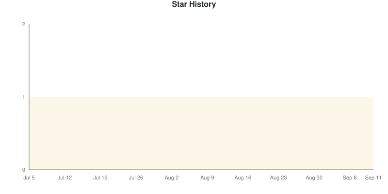
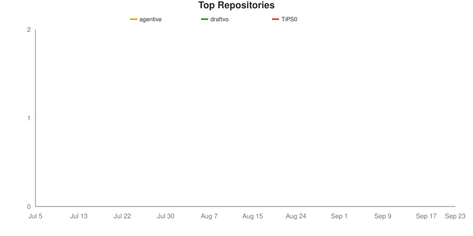
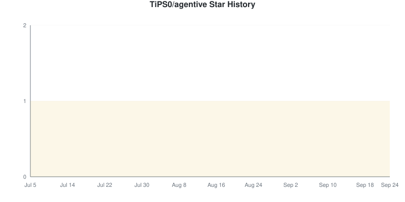
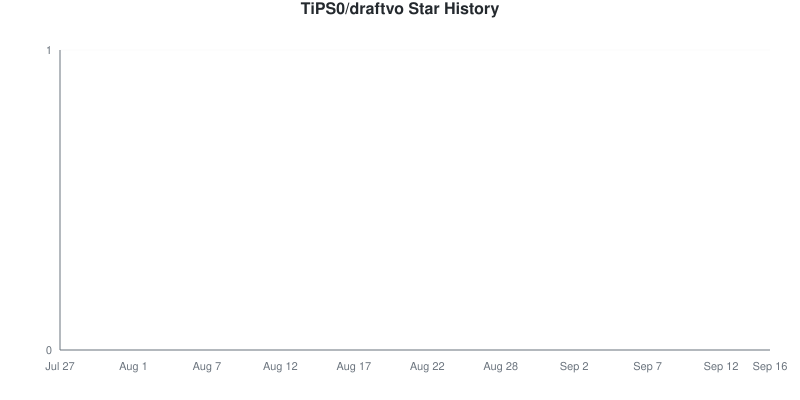
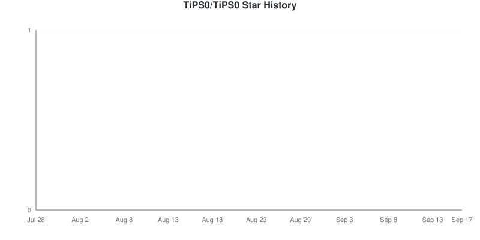
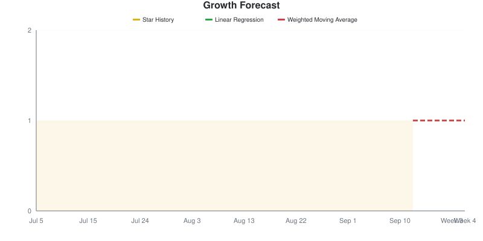

# Star Tracker Report

**2026-09-04** | Total: **1 stars** | Change: **0**

> Compared to snapshot from 2026-09-03

## 📈 Star Trend

### By Repository

Individual Repository Charts

#### TiPS0/agentive: 1 ★ (0)

#### TiPS0/draftvo: 0 ★ (0)

#### TiPS0/TiPS0: 0 ★ (0)

## Repositories

| Repositories | Stars | Change | Trend |
|:-----------|------:|-------:|:-----:|
| [TiPS0/agentive](https://github.com/TiPS0/agentive) | 1 | 0 | ➖ |
| [TiPS0/draftvo](https://github.com/TiPS0/draftvo) | 0 | 0 | ➖ |
| [TiPS0/TiPS0](https://github.com/TiPS0/TiPS0) | 0 | 0 | ➖ |

## 🔮 Growth Forecast

**Aggregate Forecast**

| Method | Week 1 | Week 2 | Week 3 | Week 4 |
|:---|---:|---:|---:|---:|
| Linear Regression | 1 | 1 | 1 | 1 |
| Weighted Moving Average | 1 | 1 | 1 | 1 |

### By Repository

TiPS0/agentive

**TiPS0/agentive**

| Method | Week 1 | Week 2 | Week 3 | Week 4 |
|:---|---:|---:|---:|---:|
| Linear Regression | 1 | 1 | 1 | 1 |
| Weighted Moving Average | 1 | 1 | 1 | 1 |

TiPS0/draftvo

**TiPS0/draftvo**

| Method | Week 1 | Week 2 | Week 3 | Week 4 |
|:---|---:|---:|---:|---:|
| Linear Regression | 0 | 0 | 0 | 0 |
| Weighted Moving Average | 0 | 0 | 0 | 0 |

TiPS0/TiPS0

**TiPS0/TiPS0**

| Method | Week 1 | Week 2 | Week 3 | Week 4 |
|:---|---:|---:|---:|---:|
| Linear Regression | 0 | 0 | 0 | 0 |
| Weighted Moving Average | 0 | 0 | 0 | 0 |

---
*Generated by [GitHub Star Tracker](https://github.com/fbuireu/github-star-tracker) on 2026-09-04T06:54:13.316Z*

*Made with 🤘 by [Ferran Buireu](https://github.com/fbuireu)*

