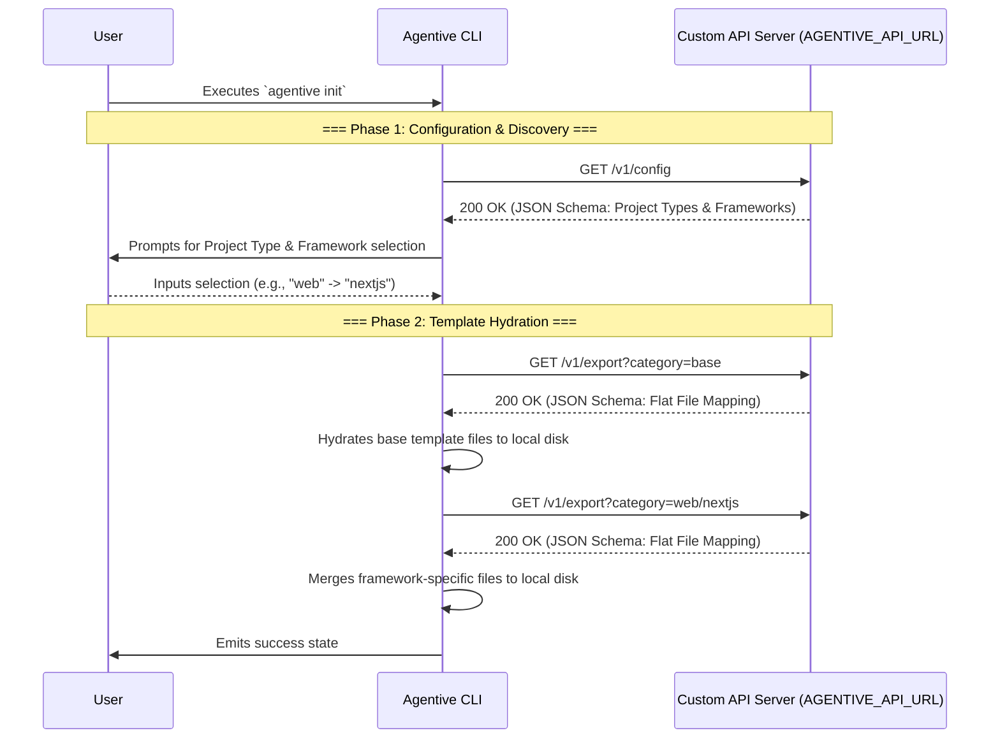

# Agentive NAS API Specification

> **AI Agent Instructions:** This document establishes the definitive API contract for the `agentive` CLI when operating in Remote Execution Mode (`AGENTIVE_API_URL`). Any backend architecture, private registry, or NAS server engineered to distribute `agentive` templates must strictly conform to the JSON schemas defined below.

## Architectural Overview

To facilitate seamless remote template distribution, the `agentive` CLI employs a strictly read-only architecture against the remote server. Therefore, to implement a custom, fully-compliant backend infrastructure for `agentive`, **developers are only required to implement two `GET` endpoints.** 

The CLI does not issue `POST`, `PUT`, or `DELETE` requests; all state mutations occur locally on the user's filesystem.

## Interaction Sequence

The following sequence diagram illustrates the precise lifecycle and interaction flow between the local CLI client and the remote backend during the `agentive init` execution sequence:



---

## 1. Discovery Configuration Endpoint

The CLI invokes this endpoint during its initialization phase to dynamically discover the catalog of supported templates available on the remote server. This payload directly drives the interactive command-line interface.

- **Endpoint:** `GET /v1/config`
- **Authentication:** Not required by the CLI (Authorization must be handled transparently via middleware or proxy if implemented).
- **Content-Type Expected:** `application/json`

### Expected Response Schema (`200 OK`)

The backend must return a JSON object containing a `projectTypes` root array. Each node within this array must define a `title` (human-readable label) and a `value` (internal system key). Nodes may optionally declare a nested `frameworks` array.

```json
{
  "projectTypes": [
    {
      "title": "Web Development",
      "value": "web",
      "frameworks": [
        {
          "title": "Next.js",
          "value": "nextjs"
        },
        {
          "title": "Nuxt",
          "value": "nuxt"
        }
      ]
    },
    {
      "title": "Desktop Development",
      "value": "desktop",
      "frameworks": [
        {
          "title": "Electron",
          "value": "electron"
        },
        {
          "title": "Tauri",
          "value": "tauri"
        }
      ]
    }
  ]
}
```

> **Resilience Strategy:** If the backend emits a malformed payload, a non-200 status code, or experiences a timeout, the CLI is engineered to gracefully degrade. It will fall back to an internal hardcoded configuration schema, rendering any missing local templates in a disabled UI state.

---

## 2. Template Export Endpoint

Following user selection, the CLI invokes this endpoint to request the raw byte content of the templates. **The CLI executes this request iteratively**—first to retrieve the universal `base` category, followed by subsequent requests for any selected framework categories.

- **Endpoint:** `GET /v1/export`
- **Query Parameters:**
  - `category` (string, required): The target directory path. By convention, this is formatted as `[projectType]/[framework]` (e.g., `web/nextjs`). The initial hydration step will always request the `base` category.
- **Content-Type Expected:** `application/json`

### Expected Response Schema (`200 OK`)

The backend must return a flattened key-value dictionary representing the requested directory tree.
- **Key:** The relative path of the file, inclusive of any subdirectories.
- **Value:** The raw string representation of the file's contents.

```json
{
  "AGENTS.md": "# Root Instructions\n\n...",
  ".aiignore": "node_modules/\ndist/\n",
  "skills/agent-debug/SKILL.md": "# Agent Debug Skill\n\n...",
  "rules/coding-standards.md": "# Standards\n\n..."
}
```

> **Critical Implementation Constraint:** The dictionary keys must **not** include the parent category prefix (e.g., `base/` or `web/nextjs/`). The CLI expects these paths to resolve directly relative to the user's local `.agents/` destination directory.
